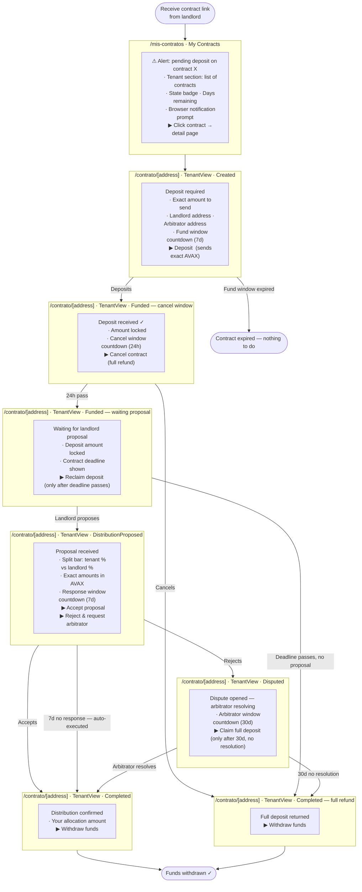
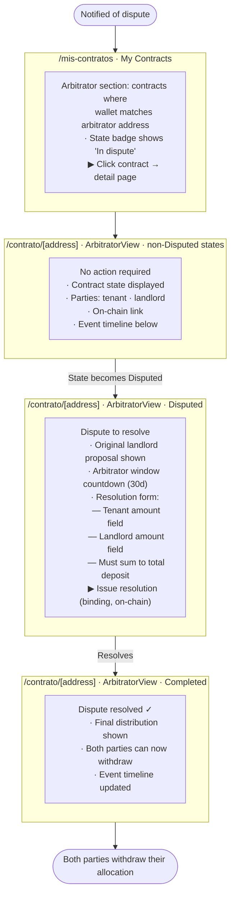

# GarantYa

**On-chain rental security deposit escrow on Avalanche.**

GarantYa replaces the traditional cash deposit with a smart contract. The tenant locks funds in a per-rental escrow; at the end of the tenancy the landlord proposes a distribution, and the tenant can accept, reject (triggering arbitration), or reclaim funds automatically if no proposal is made.

---

## Table of Contents

- [Architecture](#architecture)
- [Contract State Machine](#contract-state-machine)
- [Roles](#roles)
- [Time Windows](#time-windows)
- [User Flows](#user-flows)
- [Screens & Views](#screens--views)
- [Event Timeline](#event-timeline)
- [Off-chain Metadata (Supabase)](#off-chain-metadata-supabase)
- [Deployed Contracts](#deployed-contracts)
- [Local Development](#local-development)
- [Deploy to Fuji](#deploy-to-fuji)
- [Generate Docs](#generate-docs)
- [Project Structure](#project-structure)
- [Tech Stack](#tech-stack)

---

## Architecture

```
GarantYaFactory  (one per network)
       │
       └── deployContract(tenant, deposit, days)
                │
                ▼
         GarantYa  (one per rental agreement)
```

**`GarantYaFactory`** — Deployed once. Landlords call `deployContract()` to spin up a new `GarantYa` escrow. The factory indexes contracts by tenant and landlord for easy lookup, and holds the global arbitrator address.

**`GarantYa`** — Individual escrow contract. Holds AVAX on behalf of the tenant for the duration of the rental. Enforces the full lifecycle: funding → proposal → acceptance or dispute → withdrawal.

---

## Contract State Machine

```
Created ──fund()──► Funded ──proposeDistribution()──► DistributionProposed
                       │                                       │
              cancel() │ reclaimExpired()          accept() / │ reject()
                       │                           timeout()  │
                       ▼                              ┌────────┴──────────┐
                   Completed ◄─────────────────────── │      Disputed     │
                       ▲                              └───────────────────┘
                       │                                       │
                       └──────── resolve() / executeArbitratorTimeout()
```

| Transition | Who | Condition |
|---|---|---|
| `fund()` | Tenant | Within 7-day fund window, exact deposit amount |
| `cancelPending()` | Landlord | After fund window expires unfunded |
| `cancel()` | Tenant | Within 24h of funding |
| `proposeDistribution()` | Landlord | Contract is Funded |
| `accept()` | Tenant | Within 7-day response window |
| `reject()` | Tenant | Within 7-day response window |
| `executeTimeout()` | Anyone | After 7-day response window expires |
| `reclaimExpired()` | Tenant | After contract deadline, no proposal |
| `resolve()` | Arbitrator | Contract is Disputed |
| `executeArbitratorTimeout()` | Tenant | 30 days after dispute, no resolution |
| `withdraw()` | Tenant / Landlord | Contract is Completed |

---

## Roles

| Role | Address | Responsibilities |
|---|---|---|
| **Tenant** | Set at deploy | Funds the escrow, accepts/rejects proposals, withdraws allocation |
| **Landlord** | Set at deploy (caller of `deployContract`) | Creates the escrow, proposes distribution |
| **Arbitrator** | `globalArbitrator` from factory | Resolves disputes, can rescue stuck allocations |

> The arbitrator must be a different address from both the tenant and landlord. The factory enforces this.

---

## Time Windows

| Window | Duration | Applies to |
|---|---|---|
| Fund window | 7 days | Tenant must fund after deployment |
| Cancel window | 24 hours | Tenant can cancel after funding |
| Tenant response window | 7 days | Tenant must accept or reject a proposal |
| Arbitrator window | 30 days | Arbitrator must resolve after a dispute |
| Contract deadline | `_days` set at deploy | Tenant can reclaim if landlord never proposes |

---

## User Flows

### Landlord — all screens

```mermaid
flowchart TD
    A([Wallet not connected]) --> B

    subgraph B["/ · Home — not connected"]
        B1["Hero · tagline
        Role cards: Landlord / Tenant
        ▶ Connect wallet button"]
    end

    B --> C

    subgraph C["/ · Home — connected"]
        C1["Contract creation form
        · Tenant wallet address
        · Property address + map preview
        · Landlord name · Tenant name
        · Duration in days
        · Guarantee amount in AVAX
        · Fee breakdown: 1% shown
        ▶ Deploy contract button"]
    end

    C --> D

    subgraph D["/ · Home — success"]
        D1["✓ Contract deployed
        · New contract address
        · Link to Snowtrace explorer
        ▶ Share link  ▶ Go to contract"]
    end

    D --> E

    subgraph E["/contrato/[address] · LandlordView · Created"]
        E1["Waiting for tenant deposit
        · Expected amount
        · Tenant address · Arbitrator address
        · Fund window countdown
        · QR code of contract URL
        ▶ Copy link  ▶ Share WhatsApp  ▶ Share Telegram
        ▶ cancelPending  (after 7-day window expires)"]
    end

    E -->|Tenant deposits| F
    E -->|7 days pass, no deposit| Z1([Cancelled — no funds])

    subgraph F["/contrato/[address] · LandlordView · Funded"]
        F1["Tenant deposited
        · Deposit amount locked
        · Tenant address · Arbitrator address
        · Contract deadline countdown
        · Split bar (adjust tenant / landlord %)
        · Amount fields auto-calculated
        ▶ Propose distribution"]
    end

    F --> G

    subgraph G["/contrato/[address] · LandlordView · DistributionProposed"]
        G1["Proposal sent — awaiting tenant
        · Proposed split shown
        · Tenant response window countdown (7d)
        ▶ Execute timeout  (after 7d, no response)"]
    end

    G -->|Tenant accepts| H
    G -->|Tenant rejects| I
    G -->|7d no response| H

    subgraph H["/contrato/[address] · LandlordView · Completed"]
        H1["Distribution executed
        · Your allocation amount
        ▶ Withdraw funds"]
    end

    subgraph I["/contrato/[address] · LandlordView · Disputed"]
        I1["Tenant rejected — arbitrator resolving
        · Dispute opened timestamp
        · Arbitrator window countdown (30d)
        · No landlord action available"]
    end

    I -->|Arbitrator resolves| H
    I -->|30d no arbitrator| Z2([Tenant claims full deposit])

    H --> Z3([Funds withdrawn ✓])
```



---

### Tenant — all screens



---

### Arbitrator — all screens



---

## Event Timeline

The contract detail page displays a live timeline of all on-chain events for each escrow. Events are fetched via `useContractEvents` (viem `getLogs` + `decodeEventLog`) starting from `FACTORY_DEPLOY_BLOCK` to avoid scanning from genesis.

Timestamps are estimated from block numbers using Fuji's ~1 block/second rate.

| Event | Color | Meaning |
|---|---|---|
| `ContractCreated` | grey | Escrow deployed by the landlord |
| `Funded` | green | Tenant deposited the exact amount |
| `Proposed` | amber | Landlord submitted a distribution proposal |
| `Accepted` | green | Tenant accepted the proposal |
| `Rejected` | red | Tenant rejected — dispute opened |
| `Resolved` | blue | Arbitrator resolved the dispute |
| `TimeoutExecuted` | grey | Proposal auto-executed after tenant window expired |
| `ArbitratorTimeoutExecuted` | amber | Tenant reclaimed funds after arbitrator window expired |
| `Reclaimed` | grey | Tenant reclaimed after contract deadline with no proposal |
| `Cancelled` | grey | Tenant cancelled within 24h of funding |
| `CancelledPending` | grey | Landlord cancelled an unfunded contract |
| `Withdrawn` | green | A party withdrew their allocated funds |

---

## Off-chain Metadata (Supabase)

Smart contracts only store addresses and amounts on-chain. Human-readable metadata is stored off-chain in Supabase and linked by contract address.

**Schema (`ContractMetadata`):**

| Field | Type | Description |
|---|---|---|
| `address` | `string` | Contract address (primary key) |
| `property_address` | `string` | Physical address of the rental property |
| `landlord_name` | `string` | Display name of the landlord |
| `tenant_name` | `string` | Display name of the tenant |
| `photo_url` | `string?` | Optional photo of the property |
| `created_at` | `string?` | ISO timestamp of record creation |

**Environment variables required:**

```
NEXT_PUBLIC_SUPABASE_URL=https://your-project.supabase.co
NEXT_PUBLIC_SUPABASE_ANON_KEY=your_anon_key
```

The anon key is public and safe to expose in the frontend. Access is controlled by Supabase Row Level Security (RLS) policies on the table.

---

## Deployed Contracts

### Avalanche Fuji Testnet (chainId: 43113)

| Contract | Address |
|---|---|
| `GarantYaFactory` | [`0x1963289781C6B58967C69921ff99FFB0B0d0D61d`](https://43113.testnet.snowtrace.io/address/0x1963289781C6B58967C69921ff99FFB0B0d0D61d) |
| Deploy block | `53042152` |
| Arbitrator | `0x2Cb187B150540e1F72338b783666DCA1A37a190a` |
| Version | `8.0.0` |

---

## Local Development

**Prerequisites:** Node.js 18+, npm.

```bash
# 1. Install dependencies
npm install

# 2. Copy the environment file
cp .env.local.example .env.local
# Fill in NEXT_PUBLIC_WALLET_CONNECT_ID at minimum

# 3. Start a local Hardhat node
npx hardhat node

# 4. Deploy to localhost (separate terminal)
npx hardhat run scripts/deploy.js --network localhost

# 5. Start the frontend
npm run dev
```

The app runs at `http://localhost:3000`.

---

## Deploy to Fuji

```bash
# 1. Set the following in .env.local:
#    DEPLOYER_PRIVATE_KEY=<your wallet private key>
#    ARBITRATOR_ADDRESS=<a separate wallet address>

# 2. Run the deploy script
npx hardhat run scripts/deploy.js --network fuji

# 3. Copy the printed values into .env.local:
#    NEXT_PUBLIC_FACTORY_ADDRESS=<printed address>
#    NEXT_PUBLIC_FACTORY_DEPLOY_BLOCK=<printed block>
```

> **Security:** Never commit `.env.local` to version control. It contains your private key.

---

## Generate Docs

Contract reference docs are auto-generated from NatSpec comments via `solidity-docgen`.

```bash
npx hardhat docgen
```

Output is written to [`docs/GarantYa.md`](docs/GarantYa.md).

---

## Project Structure

```
contracts/
  GarantYa.sol              # GarantYa + GarantYaFactory contracts
scripts/
  deploy.js                 # Deploys GarantYaFactory to any configured network
docs/
  GarantYa.md               # Auto-generated contract reference (NatSpec)
src/
  app/
    page.tsx                # Create new contract screen
    mis-contratos/
      page.tsx              # List of contracts for the connected wallet
    contrato/[address]/
      page.tsx              # Contract detail — auto-detects role and shows correct view
  components/
    views/
      TenantView.tsx        # Tenant UI (fund, cancel, accept, reject, withdraw)
      LandlordView.tsx      # Landlord UI (propose distribution, withdraw)
      ArbitratorView.tsx    # Arbitrator UI (resolve dispute, rescue allocation)
    ui/
      Button.tsx
      Badge.tsx
      Input.tsx
    Logo.tsx
    Nav.tsx
    Countdown.tsx           # Live countdown for time windows
    SplitBar.tsx            # Visual deposit split bar
    DataRow.tsx
  lib/
    contract.ts             # ABI (from artifacts), factory address, enums
    supabase.ts             # Supabase client + ContractMetadata type
    wagmi.ts                # wagmi + Fuji chain config
    utils.ts                # Formatting helpers
    hooks/
      useEscrow.ts          # Main contract hook (reads + writes)
      useContractEvents.ts  # Fetches and decodes on-chain event logs for the timeline
  providers/
    Web3Provider.tsx        # RainbowKit + wagmi provider
```

---

## Tech Stack

| Layer | Technology |
|---|---|
| Smart contracts | Solidity 0.8.20, OpenZeppelin 5 |
| Contract tooling | Hardhat, hardhat-toolbox, solidity-docgen |
| Frontend | Next.js 14, React 18, TypeScript |
| Wallet / Web3 | wagmi v2, RainbowKit v2, viem v2 |
| Off-chain storage | Supabase (property metadata) |
| Styling | Tailwind CSS |
| Network | Avalanche Fuji C-Chain (testnet) |
